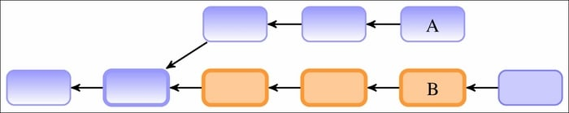
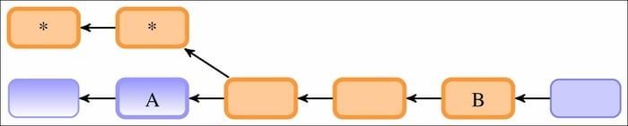
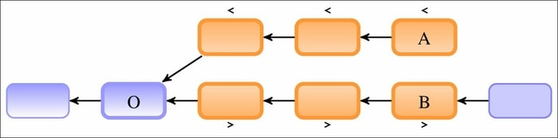

# Ch02 Exploring Project History


> **Directed Acyclic Graph（DAG，有向无环图）**
>
> Git 用来表示项目可能的非线性历史的结构（抽象层次），称为 **有向无环图（DAG）**


**双点符号(Double dot notation)**

即 `A..B`：选中的版本为从 `B` 可以回溯到、但从 `A` 无法回溯到的所有版本。例如：


再如非线性：



更复杂的：



要排除标有星号 `*` 的提交版本，使用 `--strict-ancestor` 参数。

> 应用举例
>
> 1. 查看 `experiment` 分支中有哪些尚未合并到 `master` 分支：`git log master..experiment`
> 2. 查看即将推送到远程仓库的内容：`git log origin/master..HEAD` 或者 `git log origin/master..`，缺省部分会用 `HEAD` 指针自动补全


**多点 - 包括和不包括修订 (Multiple points)**

查看 `maint` 或 `master` 分支上有、但在 `next` 分支中没有的所有修订：`git log maint master ^next`

由此可见，`A..B` 只是 `B ^A` 的简写。

如果有多个分支需要排除，不必逐一添加 `^` 符号，使用 `--not <branch1> <branch2>` 即可，如：

`B ^A ^C` 等效于 `B --not A C`

查看指定版本 `A` 与上一版的修订：`A^!`，这里分两种情况：

- 不存在合并时：表示 `A^..A`
- 存在合并时：表示 `A --not A^@`，其中 `A^@` 表示 `A` 的所有父节点


**三点符号 (Triple-dot notation)**

`A...B`：该语法选择两个引用中任选其一可以到达的所有提交，但不是两个引用都能到达的所有提交。



图中的 `<` 和 `>` 表示该变更是位于哪个分支上，分别表示左分支、右分支。例如：

```bash
$ git log --oneline --left-right 37ec5ed...8cd8cf8
>8cd8cf8 Merge branch 'fc/remote-helper-refmap' into next
>efcd02e Merge branch 'rs/more-starts-with' into next
>831aa30 Merge branch 'jm/api-strbuf-doc' into next
>1aeca19 Merge branch 'jc/revision-dash-count-parsing' into next
<1a7e8e8 Revert "replace: add --graft option"
<7a30690 t9001: avoid non-portable '\n' with sed
>5cc3268 fetch doc: remove "short-cut" section
```

`A...B` 等效于 `A B --not $(git merge-base --all A B)`，其中 `$(…)` 表示基于 `POSIX shell` 语法的 `shell` 命令替换。

除了用在 `git log` 的范围选定，三点符号也能用于 `git diff` 命令：`git diff A...B`。它表示从 `A` 和 `B` 共同的祖先版本开始（分歧节点），演变到 `B` 的所有变更，不包括自分歧以来在 `A` 上所做的变更。等效于：`git diff $(git merge-base A B) B`


**历史版本检索**

只想看到添加或重命名文件的改动：`git log --diff-filter=AM`（详见 `git-log(1)` 帮助页）


`git blame`：归咎操作