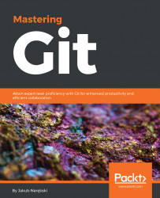

# 《Mastering Git》Learning Notes


## 1. Profiles




|    **Title**    | **Mastering Git** [ISBN: 978-1-78355-375-4] |
| :-------------: | :-----------------------------------------: |
|   **Author**    |    **Jakub Narębski , Jakub S Narebski**    |
| **Publication** |              **Packt, 2016.4**              |
|    **Pages**    |                   **418**                   |

> **Introduction**
>
> Git is one of the most popular types of Source Code Management (SCM) and Distributed Version Control System (DVCS). Despite the powerful and versatile nature of the tool enveloping strong support for nonlinear development and the ability to handle large projects efficiently, it is a complex tool and often regarded as “user-unfriendly”. Getting to know the ideas and concepts behind the architecture of Git will help you make full use of its power and understand its behavior. Learning the best practices and recommended workflows should help you to avoid problems and ensure trouble-free development. The book scope is meticulously designed to help you gain deeper insights into Git's architecture, its underlying concepts, behavior, and best practices. Mastering Git starts with a quick implementation example of using Git for a collaborative development of a sample project to establish the foundation knowledge of Git operational tasks and concepts. Furthermore, as you progress through the book, the tutorials provide detailed descriptions of various areas of usage: from archaeology, through managing your own work, to working with other developers. This book also helps augment your understanding to examine and explore project history, create and manage your contributions, set up repositories and branches for collaboration in centralized and distributed version control, integrate work from other developers, customize and extend Git, and recover from repository errors. By exploring advanced Git practices, you will attain a deeper understanding of Git’s behavior, allowing you to customize and extend existing recipes and write your own.


## 2. Outlines

Status available：:heavy_check_mark: (Completed) | :hourglass_flowing_sand: (Working) | :no_entry: (Not Started) | :orange_book: (Finish reading)

| No.  |                        Chapter Title                         |          Status          |
| :--: | :----------------------------------------------------------: | :----------------------: |
| Ch01 |             [Git Basics in Practice](./Ch01.md)              |    :heavy_check_mark:    |
| Ch02 |            [Exploring Project History](./Ch02.md)            |    :heavy_check_mark:    |
| Ch03 |               [Developing with Git](./Ch03.md)               | :hourglass_flowing_sand: |
| Ch04 |             [Managing Your Worktree](./Ch04.md)              |        :no_entry:        |
| Ch05 |       [Collaborative Development with Git](./Ch05.md)        |        :no_entry:        |
| Ch06 |          [Advanced Branching Techniques](./Ch06.md)          |        :no_entry:        |
| Ch07 |            [Merging Changes Together](./Ch07.md)             |        :no_entry:        |
| Ch08 |              [Keeping History Clean](./Ch08.md)              |        :no_entry:        |
| Ch09 | [Managing Subprojects – Building a Living Framework](./Ch09.mc) |        :no_entry:        |
| Ch10 |          [Customizing and Extending Git](./Ch10.md)          |        :no_entry:        |
| Ch11 |               [Git Administration](./Ch11.md)                |        :no_entry:        |
| Ch12 |               [Git Best Practices](./Ch12.md)                |        :no_entry:        |


Powershell script for generating markdown files in batch:

```powershell
# Create 12 empty markdown files named Ch##.md:
for($i=1; $i -le 12; $i=$i+1){ New-Item -Name "Ch$('{0:d2}' -f $i).md"; }
```

 
